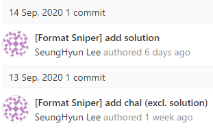

# Blind Shot

One dprintf() call with format-string bug, no output.

## Solution

Recall the `argv` parameter of `main` function. Assuming that the given binary is not manually `exec`-ed as `argv = NULL`, `argv` points to the array of arguments given at binary execution, which the first one `argv[0]` would be char pointer pointing to the binary executable's name. Let us now refer to the position of `argv` as `A`, and `argv[0]` as `B`.

Since `A` is located at lower memory address than `B`, we can use `%hhn/%hn` at `A` to partially overwrite the value of `B` to return address of `service()`. Then use `%hhn/%hn` at `B` to partially overwrite the return address to address inside `main` function, just before `service()` parameters are loaded and called (offset 0x128E). This is the "Return" primitive that we can use to do exploit the FSB once more, and can trivially be extended to leak data before returning ("Leak+Return" primitive).

Since there aren't any other useful values in the stack, one can think of using `A` and `B` to do the following:
1. Write from `A` to `B` such that the value at `B` changes to some stack address `C` (from now on represented as notation `A->B=C`)
1. `B->C=D` for some value `D`
1. `A->B=RET` for address of return address `RET`
1. `B->RET=(before service() call)`

The above 4 steps, if possible, creates a "Write+Return" primitive. This is very useful since we can write any value to stack, then return back to `main` and exploit FSB with our written value accessible as argument.

However, the above is impossible due to how positional argument is implemented in glibc `printf_positional`. `printf` processes the format strings from the start, fetching arguments one by one when it sees a new format specifier. Therefore, steps 1 and 2 are possible. When `printf` sees a positional argument specifier, it immediately resorts to `printf_positional` which starts by caching all arguments to be used. Thus, if we perform step 3 using positional argument, the value written at `B` will be cached as `C` which result in step 4 being `B->C=(start of main)`.

With a clear understanding of how argument caching in `printf_positional` works and with some novel ideas, we can think of setting `C` as `A`, `D` as `RET`, and `RET` as `(before service() call)`. Let's write the steps once more, now with `$` representing use of positional argument:
1. `A->B=A`
1. `B->A=RET`
1. `$A->RET=(before service() call)`

This idea isn't just some random magic. The key point of this idea is to **change the pointer direction of `A` and `B` from `A->B` to `B->A`** with the "Return" primitive. This "Flip+Return" primitive will enable the "Write+Return" primitive as shown below:
1. `A->RET=(before service() call)`
1. `B->A=C`
1. `$A->C=D`
1. `$B->A=RET`

With this primitive, the rest can be done with the aforementioned primitives and simple ROP. The complete steps are as below:
1. "Flip+Return", check liveliness (1.5 byte stack addr bruteforce)
1. "Write+Return", overwrite `fd = open("/dev/null")` saved at stack frame of `main()` to 1
1. "Leak+Return" -> Leak libc address from `__libc_start_main` saved at stack
1. "Write+Return" -> Write ROP chain at return address of `main()`
1. "Return" to (pop-)*ret gadget -> ROP chain triggered

I found this technique by auditing vfprintf-internal.c code, but there are some [references](https://j00ru.vexillium.org/slides/2015/insomnihack.pdf#page=98) to work out the technique.

## Exploit Code

See [solver.py](solver.py)

## Remarks

This chal is similar to [De1CTF 2019 "unprintable"](https://ctftime.org/task/8930).

Funny enough, I've already made a chal to be released on GoN 2020 Fall Qualification CTF (internal) with almost the same setup. Even more interesting is that the chal name was even relevant - "Format Sniper". What a coincidence 😂

